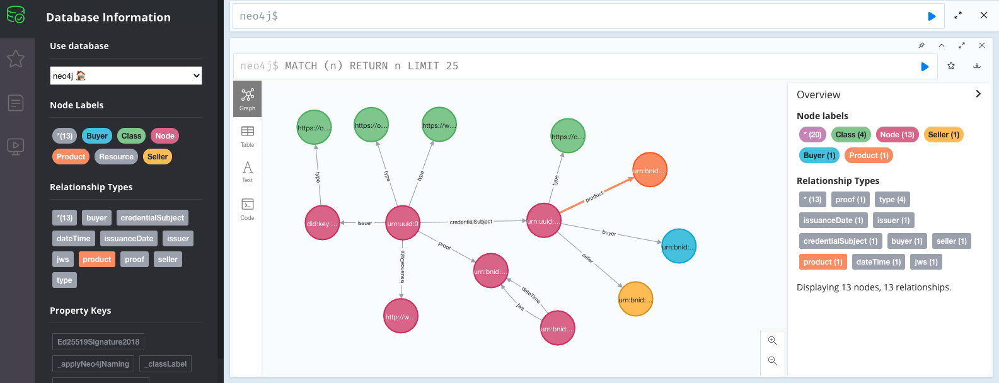

### E-Commerce Chemistry Reagent Import

- [Source](https://github.com/OR13/neo-vc)

Example based on [RileRed - Turning cotton balls into cotton candy](https://www.youtube.com/watch?v=vHuFizITMdA).

The flow described with Verifiable Credentials and Presentations is for demonstration purposes, and the data elements provided here are not recommended outside of an education context.



```
npm i
docker-compose up
npm run test
```

#### Actors

Examples generated with [https://api.did.actor/](https://api.did.actor/).

### Professor Alice

Alice is a chemistry teacher, ordering supplies to teach her students about enzymes and sugar.

```
did:key:z6MkpJ7szHBshTMun5qfz6A9k3cFZPa4ssfLPpXFmdgBmzVi
```

```
critic try twenty aware pond way medal walk stairs affair stamp mistake
```

### Seller Bob

Bob runs a small chemistry supply business and sells his products on online market places.

```
did:key:z6MkvoGbReWK18E1YnKV1ftnYMKHErbf4axvsDJyoeq8Q1X4
```

```
pause door furnace sign reveal vendor learn faint tattoo abstract group embark
```

### Customs Charlie

Charlie works for Canadian Customs.

```
did:key:z6MkoiZJdscYnpb6qev3QANiMeZ8FZm3CATQmKzucfgZXvx2
```

```
reveal grain gas regular stairs seat zoo horror winter surge worry embody
```

### DMV Debbie

Debie works for Canadian DMV.

```
did:key:z6MkkRzLJEypp9GumMsbfmqZQAkuM2xKo3rNEyPWhKbxggQc
```

```
kangaroo income laundry wolf hover arena earn inherit mule inside wide rhythm
```
